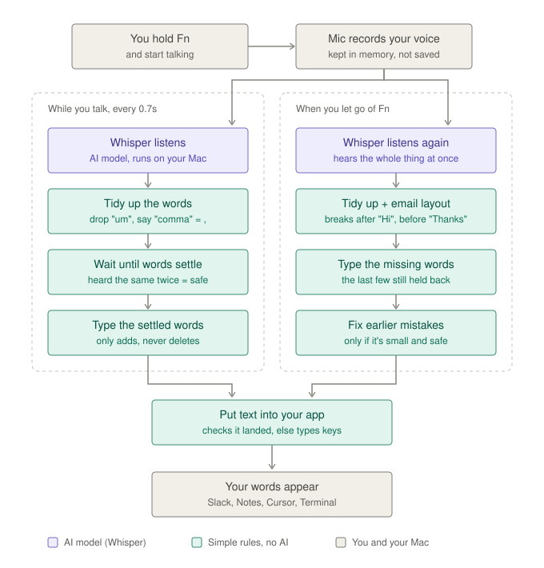

# talkflow

Dictation for your Mac. Hold **fn**, speak, let go: your words are typed into
whatever text field you are in. No account needed.



## Download

| Platform | Download |
|---|---|
| macOS (Apple Silicon) | [Download](https://talkflow.live/download/mac-apple-silicon) |
| macOS (Intel) | [Download](https://talkflow.live/download/mac-intel) |
| Windows | [Download](https://talkflow.live/download/windows) |

Requires macOS 13 or later. Windows is in progress (the Windows page says when it is ready).

The app is not notarized yet, so macOS asks you to confirm the first time you
open a downloaded copy.

**Build from source** (needs the Swift toolchain, `xcode-select --install`):

```bash
git clone https://github.com/saamirkhrl/talkflow.git
cd talkflow
./install.sh
```

## How it works

1. Hold **fn** and speak.
2. Let go of **fn**.
3. Your words are typed into the focused text field, once, when you release.

Nothing is typed while you speak, so nothing is ever deleted and retyped. This
is what makes it feel smooth. English only.

## First launch

Setup walks you through it:

1. Permissions: **Microphone**, **Accessibility** and **Input Monitoring**.
2. It installs the speech engine (`whisper-cpp` via Homebrew) and downloads the
   English model (about 500 MB).

## Privacy

- Speech is transcribed locally by Whisper (whisper.cpp) on your Mac.
- Optional: in Settings you can add your own OpenAI key (transcription) or
  Anthropic key (punctuation). That step then goes to that provider. It is off
  unless you add a key.
- The app checks GitHub for updates shortly after it starts (when you are
  online), every few hours while it runs, and when you open the dashboard. It
  downloads only the release's small manifest file (or asks the GitHub API,
  for older releases). A newer version shows in the menu bar menu and as one
  notification. Updates install only when you click, and not at all if the
  download does not match the release's sha256 checksum. See
  [docs/releases.md](docs/releases.md).
- Your data lives in one folder, `~/Library/Application Support/talkflow/`:
  `stats.json` for your stats, `settings.json` for your settings and learned
  words.

## Uninstall

In talkflow's **Settings**, scroll to **Uninstall talkflow** and click
**Uninstall...**. It removes the app,
the speech engine and its background service, the speech models, `whisper-cpp`
from Homebrew (unless another Homebrew package needs it), saved API keys, logs,
caches, the login item and the app's permissions.

Your data folder is kept, so reinstalling picks up where you left off. Delete
`~/Library/Application Support/talkflow/` for a completely fresh start.

## Troubleshooting

| Symptom | Fix |
|---|---|
| Holding fn does nothing | Open **Setup...** from the menu bar; each step should show a green check. If Input Monitoring was just granted, press **Restart talkflow**. |
| The emoji picker or dictation opens when you press fn | System Settings > Keyboard > "Press the globe key to" > **Do Nothing**. |
| Words never appear | The speech engine may be down. `curl http://127.0.0.1:8178/` should answer. Log: `~/Library/Logs/TalkFlow/whisper-server.log`. |
| A permission is on but it still fails | Remove talkflow from that list in System Settings, run **Setup...** again and re-grant it. |

## Development

```bash
./deploy.sh   # release build, install to /Applications, re-sign, restart the LaunchAgent
```

Self-tests, run against the installed binary:

```bash
B=/Applications/talkflow.app/Contents/MacOS/talkflowd
$B --streamtest              # append-only streaming logic
$B --typetest                # the writing layer (takes focus)
$B --rectest 3               # mic capture and transcription round trip
$B --formattest "raw text"   # the text pipeline, no microphone
$B --dashboardshot           # render the dashboard to PNGs
$B --enginecheck             # setup state: engine, model, permissions
$B --uninstallplan           # what Uninstall would remove, changes nothing
$B --focusprobe              # what the focused element accepts
$B --writetest [seconds]     # which write path the focused app accepts
$B --newlinetest [seconds]   # whether a newline sends a chat message
```

Source layout (`Sources/talkflowd/`):

| file | role |
|---|---|
| `Dictation.swift` | orchestrator: record, transcribe, format, write |
| `Recorder.swift` | mic to in-memory audio |
| `Transcriber.swift` | sends audio to the local whisper-server |
| `FieldWriter.swift` | Accessibility write, verified before it is believed |
| `LiveType.swift` | paced keystroke write |
| `TextCommands.swift`, `Cleanup.swift` | spoken punctuation, lists, filler removal |
| `Hotkey.swift` | fn key via CGEventTap |
| `Onboarding.swift`, `Permissions.swift` | first-run setup and permissions |
| `SpeechEngine.swift` | installs and runs whisper-server and the model |
| `Preferences.swift`, `Vocabulary.swift` | settings and learned words |

The marketing site is a Next.js app in `client/`.

## Windows

The Windows app lives in `windows/` and is built by
`.github/workflows/windows.yml`, which attaches
`talkflow-windows-x64-setup.exe` and `talkflow-windows-arm64-setup.exe` to
each release. Windows 10 (1809) or later.

- **Install:** run the installer. It installs for your account only, no
  administrator rights, to `%LOCALAPPDATA%\Programs\talkflow`. The installer is
  not code-signed yet, so Windows SmartScreen may say it "protected your PC":
  click **More info**, then **Run anyway**.
- **First launch:** setup opens and does the rest by itself. It downloads the
  English model (about 500 MB, once) in the background, keeps checking
  microphone access (Settings > Privacy & security > Microphone, including "Let
  desktop apps access your microphone") and, if it is off, opens that page for
  you, then starts the speech engine and gives you a box to try it in. Closing
  setup does not stop the download. The speech engine (whisper.cpp) ships in
  the installer.
- **Dictate:** hold **Ctrl + Win**, speak, let go. The shortcut can be changed
  in Settings. If focus moved to another app, or the app runs as administrator,
  the text goes to the clipboard instead.
- **Your data:** `%APPDATA%\talkflow\` holds `stats.json` and `settings.json`,
  in the same format as on the Mac, plus `windows.json` (your shortcut, and which update you were last told about). Models
  and logs are in `%LOCALAPPDATA%\talkflow\`.
- **Uninstall:** Settings > **Uninstall...**, or Windows Settings > Apps >
  talkflow > Uninstall. Either removes the app, the speech engine, the models,
  logs, the startup entry and saved API keys, and keeps `%APPDATA%\talkflow\`.

Development: `dotnet test windows/Talkflow.Core.Tests` runs the text-rule tests
on any OS, including the Mac app's own outputs for 860 transcripts
(`windows/tools/make_golden.py` regenerates them). On Windows,
`talkflow.exe --formattest "raw text"` prints what a dictation would type.

## License

MIT
